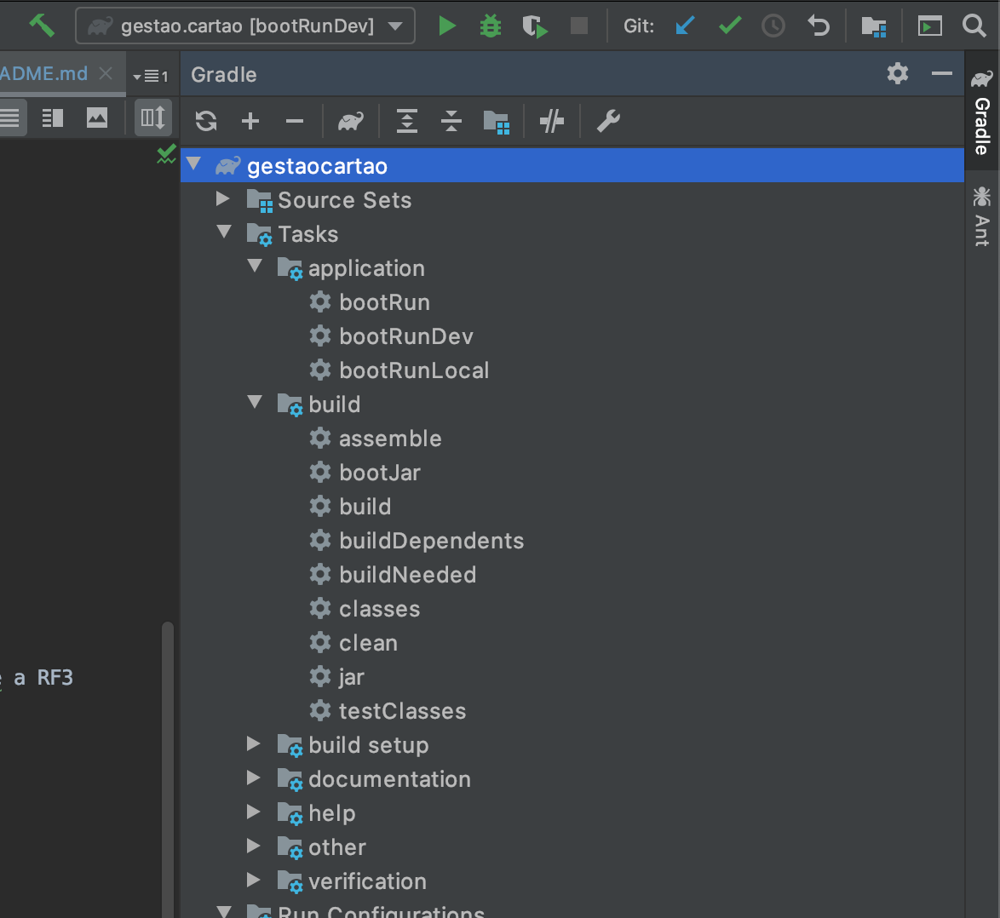

# Avaliaçao Spring

Aplicação desenvolvida em Kotlin com Spring Framwork para atender a avaliação da disciplina Spring Fraemwork - Professor FABIO TADASHI MIYASATO  

A FIAP resolveu criar seu próprio cartão de crédito para ser utilizado pelos alunos e para isso necessita de um sistema para gerenciamento e integração com outras empresas. Desenvolva este sistema com os seguintes requisitos:  

RF1 - Cadastro de Alunos  

RF2 - O cadastro inicial dos potenciais clientes do cartão será realizado via integração com um arquivo .txt disponibilizado
https://drive.google.com/open?id=19ILqrYjOEe4C840ZRwhKDauvhDZCKcWa  

RF3 - As compras realizadas nos cartões dos clientes serão recebidas via integração com uma Autorizadora. Criar os endpoints necessários para receber as realizações de transações.  

RF4 - Deve ser possível gerar um extrato via download (endpoint) ou enviado no email do cliente (pode escolher uma opção).  
  
RNF1 - Utilizar o Spring Framework.  
RNF2 - Criar um arquivo readme.md com as instruções para subir o/os projeto/s.  
RNF3 - Criar testes unitários e integrados para o/os projeto/s.  
RNF4 - Gerar uma massa simulada de transações.  
RNF5 - Documentação Swagger  
  
Não é necessário criar nenhuma tela/front-end e nem fazer o deploy dos serviços (mas também não é proibido).  
A escolha das ferramentas é livre (banco de dados, container etc), mas devem ser justificadas no readme.md

## Tecnologia

### Spring Batch

1. Atender a RF2

### H2 Database

1. Desenvolvimento Local
2. Testes Integrados

### PostgreSQL

1. Melhor gerenciamento de transações referente a RF3

## Como executar a aplicação

### Modo Local

1. Executar a task bootRunLocal


### Modo Dev (Hom->Prod like)
1. Executar a instância do postgresql via docker:
```
doker run --name some-postgres -e POSTGRES_PASSWORD=mysecretpassword -d -p 5432:5432 postgres
```

2. Executar a task bootRunDev


## Funcionalidades

**Carga Batch Clientes**

Para executar a carga batch inicial de cliente chame o endpoint:
```
http://localhost:9006/job/run
```

**Gestão de Alunos**

Obter todos os Alunos
```
GET: http://localhost:9006/aluno/
```
Obter Aluno por Id
```
GET: http://localhost:9006/aluno/{id}
```
Cadastrar Aluno
```
POST: http://localhost:9006/aluno/
```
```json
{
  "nome": "Caio Norbiato",
  "documento": "333950",
  "email": "caio@norbiato.net"
}
```

**Gestão de Transações**

Obter todos as transações
```
GET: http://localhost:9006/transacao/
```
Obter transacao por id
```
GET: http://localhost:9006/transacao/{id}
```
Inserir transacao
```
POST: http://localhost:9006/aluno/
```
```json
{
    "valorCompra": 399.90,
    "dataHoraCompra": "1970-01-01T00:00:00",
    "aluno": {
        "id": 1,
        "nome": "Caio Norbiato",
        "documento": "333950",
        "email": "caio@norbiato.net"
    }
}
```